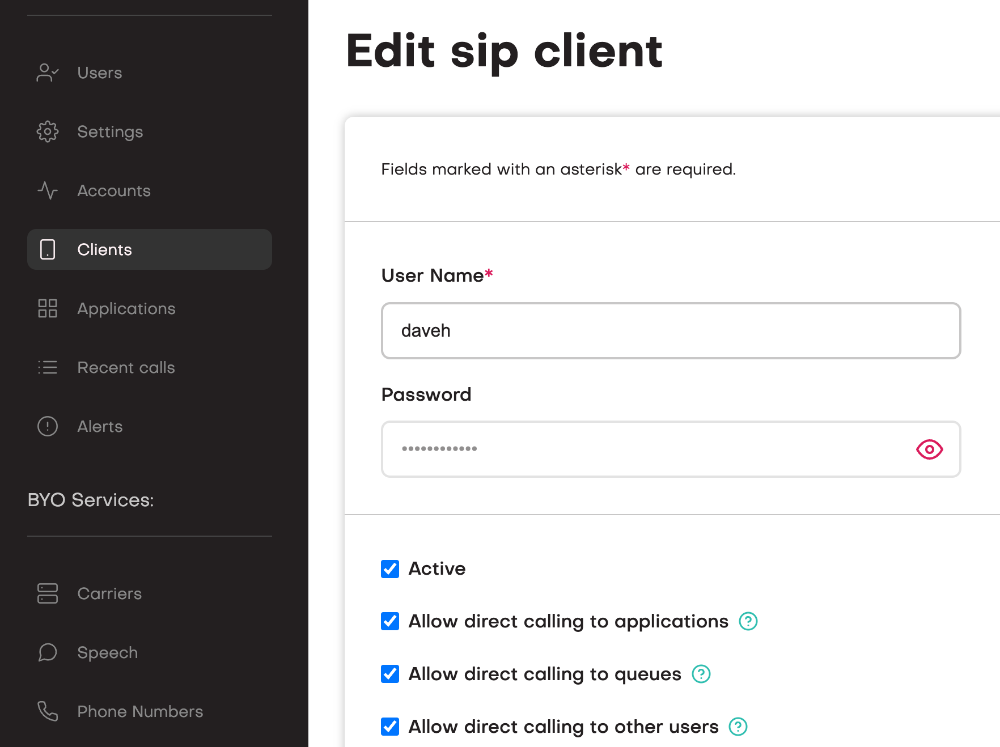

# retell-app

This is a [jambonz](https://jambonz.org) [application](https://www.jambonz.org/docs/webhooks/overview/) that allows Retell AI users to connect their agents to any SIP trunking provider or PBX.

For those of you not familiar with jambonz, it is an open source (MIT-licensed) voice gateway for CPaaS, CX/AI, and Voice/AI which is the functional equivalent of Twilio with the added ability to self-host on your own infrastructure or use our cloud service at [jambonz.cloud](https://jambonz.cloud)).  It has several advantages over Twilio:

- more cost-effective: Twilio's per-minute rounding and surcharges for using features like their voice sdk and bidirectional streaming can be eliminated, and jambonz provides all the same features (and more)
- you can bring your own carrier (jambonz has integrated with hundreds of SIP providers and PBXs)
- run awaywhere: jambonz can run in your cloud, on prem, or you can use our hosted service

jambonz also provides value-added features that you can make use of, such as answering machine detection and playing entry prompts and the like that may be more cost effective to do before connecting calls to the LLM.

## Configuration

This app is hosted at a public endpoint that you can use, but it first requires that you create some SIP trunks (i.e Carriers) on jambonz.cloud (or your self-hosted jambonz system version 0.9.4 or later).

##### Configuring Carriers on jambonz
Log into the jambonz portal and create a Carrier named 'Retell'.  Check the box for E.164 syntax, uncheck outbound authentication, and then add one SIP outbound gateway with a network address of `5t4n6j0wnrl.sip.livekit.cloud`.  Do not create any inbound gateways for this Carrier.

Next, add another Carrier for your SIP trunking provider.  This Carrier should have both inbound and outbound gateways.

Next, add a SIP client credential.  Click on "Clients" and add a sip client with a name and password.

#### Configuring Retell

Add the phone number that you are receiving calls on from your SIP trunking/DID provider in the Retell console. 

In the Retell Dashboard, select "Phone Numbers" and click the plus sign.  In the dropdown select "Connect to your number via SIP trunking".
- Add the phone number in E.164 format (ie leading + followed by country code)
- For termination URI enter a URI with the DNS of your sip realm in jambonz (you can find that under the Account tab), e.g. 'mydomain.sip.jambonz.cloud'
- For sip trunk username and password enter the username and password you created above on jambonz when you created the SIP client credential.

After creating the phone number, associate it with the Retell agent you want to use.

##### Configuring Application on jambonz

Now return to jambonz and create an application using the following websocket URI: wss://retell-app.jambonz.cloud/retell

You will see several environment variables appear below the webhook that you can provide values for:
- **pstnCarrier** - put the name of the Carrier you assigned to your SIP trunking provider
- **retellCarrier** - put the name of the Carrier you assigned to Retell
- **sipUsername** - put the sip username that you created above
- **sipPassword** - put the sip password that you created above
- **countrCode** - (Optional) If your SIP trunking provider delivers phone numbers in national format (i.e without a leading country code) then provide your country code which will be applied before we send the calls to Retell.  Retell requires all phone numbers to be presented in E.164 format which includes country code.
- **overrideCallerId** - (Optional) If you want to override the calling number on outbound calls from Retell before sending them on to your SIP trunking provider, then put the phone number you would like to appear in the From header of the outbound INVITE to your SIP trunking provider.  This is rarely needed, but as an example when completing calls through SIPgate they require a special identifier to be used in the From header rather than a phone number.

Save the application, and assign one or more phone numbers to it.
